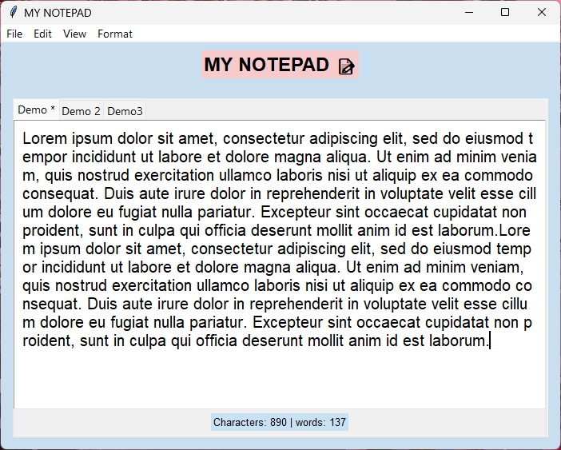

# My Notepad 📝



A simple and functional text editor built with **Python** and **Tkinter**.

## ✨ Features

- 📑 Multiple tabs
- 💾 Open, Save and Save As
- 🔍 Search and Replace All
- ✏️ Bold, Italic and Underline
- 🔠 Increase and decrease font size
- 🌙 Dark Mode
- ↩️ Undo and Redo
- 📊 Character and word counter
- ⌨️ Keyboard shortcuts
- ⚠️ Unsaved changes warning

## 🛠️ Technologies

- Python 3
- Tkinter

## ▶️ How to Run

1. Clone the repository.
2. Open the project folder.
3. Run:

```bash
python main.py
